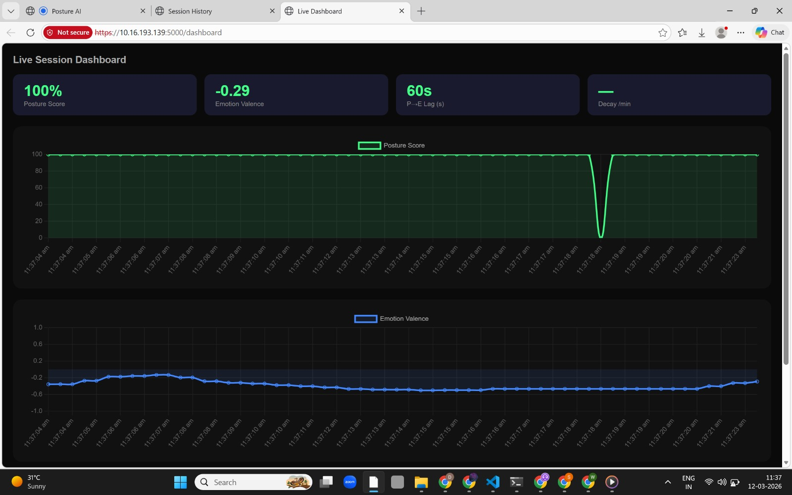
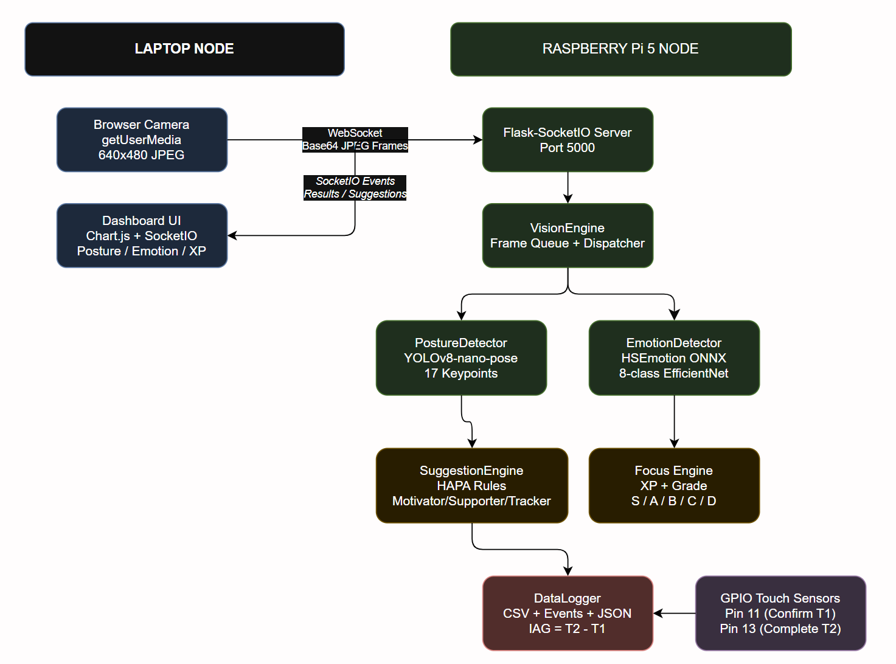

<div align="center">

# 🤖 Wellness Robot

### *Real-time posture coaching and emotion awareness — running entirely on a Raspberry Pi.*

[](https://www.python.org/)
[](https://flask-socketio.readthedocs.io/)
[](https://ultralytics.com/)

[**Overview**](#-overview) · [**Tech Stack**](#-tech-stack) · [**Features**](#-features) · [**Architecture**](#-architecture) · [**Setup**](#-setup) · [**Research**](#-research-metrics) · [**API**](#-api-reference)

---

</div>

## 🧭 Overview

Wellness Robot is an **end-to-end embedded AI system** that runs two computer vision models simultaneously on a Raspberry Pi 4 — no cloud, no third-party APIs, no subscription. A browser-based dashboard streams live posture scores and emotional valence data over WebSockets, while a psychology-grounded suggestion engine delivers behavioural nudges in real time.

The system is grounded in the **Health Action Process Approach (HAPA)** — a validated psychological model of behaviour change — making it suitable not just as a wellness tool but as a **research instrument** for studying posture habits, emotional states, and the intention–action gap.

**Key engineering highlights:**
- Two AI models running concurrently on edge hardware (no GPU)
- Temporal smoothing and confidence-delta gating to eliminate false positives
- Full session data pipeline: raw timeseries → computed metrics → CSV + JSON export
- Hardware GPIO integration with a software fallback
- Self-signed HTTPS on a local network, zero external dependencies at runtime

---

## 🛠 Tech Stack

| Layer | Technology |
|---|---|
| Edge hardware | Raspberry Pi 4 (4 GB RAM) |
| Pose estimation | YOLOv8m-pose (Ultralytics) — 640px, 17 keypoints |
| Emotion recognition | HSEmotion `enet_b2_8` ONNX (EfficientNet-B2) |
| Computer vision | OpenCV — capture, CLAHE, face detection |
| Web server | Flask + Flask-SocketIO (HTTPS, self-signed) |
| Frontend | Chart.js dashboard, live WebSocket updates |
| Signal processing | NumPy — cross-correlation, linear regression |
| Hardware I/O | lgpio (Raspberry Pi GPIO) |
| Data output | Per-session CSV timeseries + JSON summary |

---

## 🎯 Features

### Posture Detection
- YOLOv8m-pose running at 640px detects 17 body keypoints per frame
- Identifies four alert types: `head_down`, `uneven_shoulders`, `spine_lean`, `forward_hunch`
- **Temporal smoothing** — an alert fires only when it appears in ≥ 50% of the last 8 frames, eliminating noise from natural movement
- Dual hunch detection combining shoulder–hip offset and ear–shoulder offset
- Outputs a **0–100 posture score** with per-alert weighted penalties

### Emotion Detection
- HSEmotion EfficientNet-B2 model for higher-accuracy facial expression recognition
- **CLAHE contrast enhancement** handles dim rooms and uneven lighting
- **Confidence-delta gating** — a detected emotion must exceed Neutral by a margin before being reported, preventing flickering
- 7-frame temporal smoothing per detected face
- Continuous **valence score** (−1.0 → +1.0) for research logging

### Behavioural Suggestion Engine (HAPA)

Every suggestion card moves through a full HAPA lifecycle:

```
Motivation → Intention → Action → Maintenance
  (shown)     (confirmed)  (done)   (score logged)
```

The time between "Got it" and "Done!" is the **intention–action gap** — logged automatically per suggestion type.

Three personalised modes ship out of the box:

| Mode | Character | Score visible? |
|---|---|---|
| ⚡ Motivator | Energetic, goal-framed nudges | ✅ |
| 💛 Supporter | Gentle, low-pressure prompts | ✅ |
| 📊 Tracker | Silent logging only | ❌ |

### Focus Mode
- User sets a task name and a timer (25 / 45 / 90 min or custom)
- AI monitors silently — no interruptions except critical posture alerts
- End-of-session **Focus Score** (60% posture · 40% emotion) with S / A / B / C / D grade
- XP system persists across sessions in `data/xp_store.json`

### Live Dashboard
- Real-time Chart.js graphs of posture score and emotional valence
- Live P→E Lag and posture decay metrics displayed as they compute
- Accessible from any browser on the local network at `https://<pi-ip>:5000/dashboard`



---

## 🏗 Architecture



```
Raspberry Pi (server)
  │
  ├── Camera (OpenCV) — 15 FPS capture in background thread
  │
  ├── vision_engine.py
  │     ├── posture_engine.py   → YOLOv8 pose → 17 keypoints → 0–100 score
  │     └── emotion_engine.py   → HSEmotion ONNX → 8 emotions → valence −1..+1
  │
  ├── suggestion_engine.py      → HAPA logic → mode-aware suggestion cards
  ├── analysis_engine.py        → P→E lag · posture decay curve
  └── data_logger.py            → per-session CSV + JSON + intention–action gap

Browser (any device on the network)
  └── Dashboard + suggestion cards via Flask-SocketIO (HTTPS)
```

```
wellness-robot/
│
├── app.py                  Flask/SocketIO server, routing, session lifecycle
├── vision_engine.py        Camera capture, dispatches to posture + emotion
├── posture_engine.py       YOLOv8 pose detection, keypoint analysis, scoring
├── emotion_engine.py       HSEmotion inference, valence computation
├── suggestion_engine.py    HAPA logic, modes, focus mode, XP system
├── analysis_engine.py      P→E lag, posture decay, cross-correlation
├── data_logger.py          Per-session CSV timeseries + events logging
│
├── data/                   Auto-created — session files, xp_store.json
└── requirements.txt
```

---

## ⚙️ Setup

**Requirements:** Raspberry Pi 4 (4 GB RAM), Python 3.9+, USB webcam or Pi Camera, any browser on the same network.

```bash
# 1. Clone
git clone https://github.com/your-username/wellness-robot.git
cd wellness-robot

# 2. Install dependencies
pip install flask flask-socketio opencv-python numpy ultralytics hsemotion-onnx pyopenssl

# 3. Run
python app.py
# Starts on port 5000 with self-signed HTTPS
# yolov8m-pose.pt downloads automatically on first run

# 4. Open in browser
# https://<YOUR_PI_IP>:5000
# Accept the certificate warning, pick a mode, and begin.
```

---

## 🔬 Research Metrics

Three files are written per session to `data/`:

| File | Contents |
|---|---|
| `{session_id}_timeseries.csv` | Posture score + emotion valence, every 10 seconds |
| `{session_id}_events.csv` | All suggestions, confirms, completions, dismisses with timestamps |
| `{session_id}_summary.json` | P→E lag, decay rate, mean scores, intention–action gaps |

**P→E Lag** — cross-correlation of the posture and emotion time series reveals whether posture drops *before* mood drops, and by how many minutes. Positive lag = posture predicts emotion.

**Posture Degradation Curve** — linear regression over the session produces a personal decay rate (posture points per minute), useful for comparing fatigue across sessions or participants.

**Intention–Action Gap** — the measured delay between a user confirming a wellness task (GPIO 11) and marking it complete (GPIO 13). A direct hardware-level proxy for the HAPA action planning construct. Tasks not completed within 5 minutes are logged separately as abandoned.

**Mode Comparison** — running participants across Motivator vs Supporter mode with identical stimuli gives a clean between-subject behavioural experiment.

---

## 🔌 Hardware (Optional)

Two capacitive touch sensors enable physical interaction independent of the browser.

| GPIO Pin | Normal Mode | Focus Mode |
|---|---|---|
| **11** | Confirm task | End focus session |
| **13** | Complete task | — |

The app runs fully without GPIO — all interactions are mirrored in the browser UI.

---

## 📡 API Reference

### HTTP Routes

| Route | Description |
|---|---|
| `GET /` | Main UI |
| `GET /dashboard` | Live analytics dashboard |
| `GET /history` | Session history browser |
| `GET /history_data` | Session summary list (JSON) |
| `GET /stats` | Live analysis metrics (JSON) |

### SocketIO Events — Browser → Pi

| Event | Payload | Action |
|---|---|---|
| `start_session` | `{mode, user_id}` | Initialise all engines |
| `confirm_task` | — | Confirm current suggestion |
| `complete_task` | — | Mark task done |
| `dismiss_task` | `{key}` | Dismiss suggestion |
| `start_focus` | `{task, duration_s}` | Start focus session |
| `end_focus` | — | End session early |
| `end_session` | — | Finalise and save data |

### SocketIO Events — Pi → Browser

| Event | Payload |
|---|---|
| `vision_result` | Posture score, emotion, progress %, focus time remaining |
| `suggestion` | Full suggestion card data |
| `task_confirmed` | Acknowledgement + HAPA stage update |
| `task_completed` | Score, intention–action gap, XP earned |
| `focus_complete` | Grade, focus score, posture/emotion averages, XP |

---

## 🤝 Contributing

Open contributions are welcome. Priority areas:

- **Model upgrades** — YOLO11 pose models and YuNet face detector (`face_detection_yunet_2023mar.onnx`) are already stubbed in the structure
- **New metrics** — session-to-session trends, multi-user comparison tooling, weekly decay curves
- **New suggestion categories** — blink rate via facial landmarks, camera-to-face distance estimation for desk ergonomics
- **UI** — weekly summary screen, dark/light mode, improved focus grade animations

If you are using this for a study or paper, open an issue and share your methodology — collaboration is welcome.

---

## 📦 Dependencies

| Package | Purpose |
|---|---|
| `flask` · `flask-socketio` | Web server + real-time events |
| `ultralytics` | YOLOv8 pose estimation |
| `hsemotion-onnx` | Emotion recognition |
| `opencv-python` | Camera capture, face detection, CLAHE |
| `numpy` | Signal processing, cross-correlation, regression |
| `lgpio` | Raspberry Pi GPIO (optional) |
| `pyopenssl` | HTTPS self-signed certificate |

---

<div align="center">

Built on a Pi. Runs in a browser. Grounded in science.

</div>
